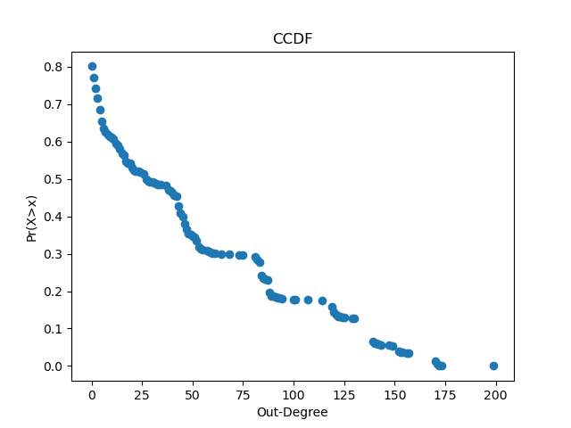
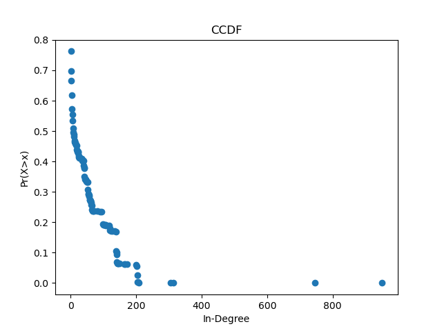

# WebCrawler

Program to build a graph of the Web. It retrieves a starting web page and extracts all hyperlinks in it. Repeats the process for each subsequent webpage.

## Fun facts
Using my web crawler, I found that the web graph starting at "http://www.caltech.edu" (limited to 2000 web pages) has the following properties:

- Average clustering coefficient: 0.634584
- Radius: 5
- Diameter: 10
- Average distance: 1.71

### Dependencies
- C++ compiler (I used G++)
- Boost library (https://www.boost.org)

### Usage

Compile the program with:
`g++ -I /YOUR/LOCAL/PATH/TO/BOOST -o crawler Crawler.cpp`

Then, execute it with:
`./crawler`

After running the crawler, plot with:
`python3 plot.py`
